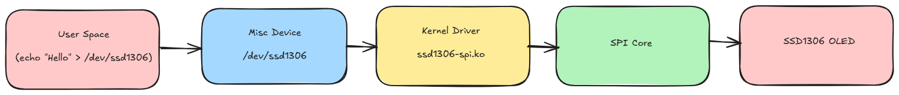
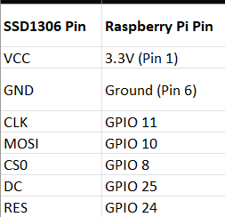
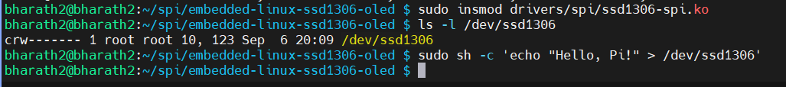
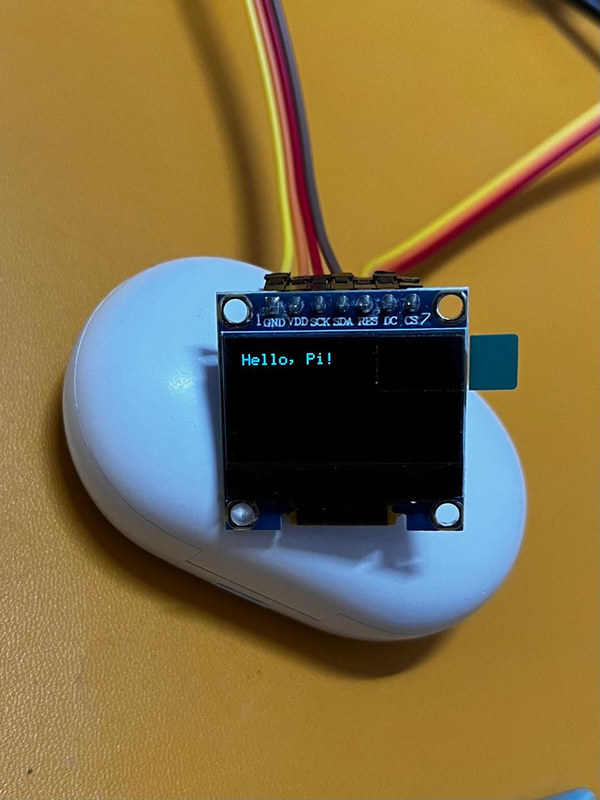

# Embedded Linux SSD1306 OLED Driver (SPI)

This project demonstrates a **custom Linux kernel driver** for the SSD1306 128x64 OLED display over **SPI**, integrated with a **misc device interface** so user space can write text directly to the display.

---

## Features
- Custom **SPI driver** for SSD1306
- **Device Tree Overlay** for Raspberry Pi
- Exposes `/dev/ssd1306` for user-space access
- `echo "Hello World" > /dev/ssd1306` displays text on OLED
- Screen **clear** and **cursor control**

---

## Project Structure

```bash
embedded-linux-ssd1306-oled
├── drivers
│   └── spi
│       └── ssd1306-spi.c
├── dt-overlays
│   └── ssd1306-overlay.dts
├── Makefile
└── README.md

```

## Architecture




* **User Space:** An application, such as the `echo` command, writes a string to a device file `/dev/ssd1306`. 

* **Misc Device (`/dev/ssd1306`):** The kernel's Miscellaneous framework provides this file-based interface. When written to, it passes the data directly to our kernel driver.

* **Kernel Driver (`ssd1306-spi.ko`):** This is the core of the project. The driver receives the text string, uses an internal font map to translate it into the corresponding pixel data, and formats it into a sequence of commands the OLED can understand.

* **SPI Core:** The driver hands off the low-level commands to the kernel's generic SPI subsystem. The SPI Core is responsible for managing the actual electrical signaling (SCLK, MOSI, CS) required to communicate with the device.

* **SSD1306 OLED:** The physical display receives the SPI signals and renders the pixel data on the screen.

## Hardware Setup

Connect the SSD1306 OLED to your Raspberry Pi's GPIO header. This driver is configured to use the default **SPI0** bus.



## Compilation and Installation

Follow these steps to compile the necessary files, install them, and configure the system.

### 1. Enable SPI
First, enable the SPI hardware interface on your Raspberry Pi:
```bash
sudo raspi-config
```
Navigate to Interface Options -> SPI -> Enable

### 2. Compile the Device Tree Overlay

Compile the .dts source file into the binary .dtbo format that the kernel requires.

```bash
make overlay
```

### 3. Compile the Kernel Driver

Use the Makefile to build the driver from the C source code into a kernel module (.ko file).

```
make module
```

### 4. Install and Configure

Move the compiled overlay to the boot directory and update the system configuration to load it on the next boot.

```bash
# Install the device tree overlay
sudo cp dt-overlays/ssd1306.dtbo /boot/firmware/overlays/

# Activate the overlay by adding its name to config.txt
echo "dtoverlay=ssd1306" | sudo tee -a /boot/firmware/config.txt
```

### 5. Reboot

A reboot is required for the Raspberry Pi to apply the new overlay and recognize the hardware setup.

```bash
sudo reboot
```

## Usage

After the system reboots with the overlay active, you can load your driver and begin sending text to the display.

1.  **Load the Kernel Module:**
    Use `insmod` to load your compiled driver into the running kernel.
    ```bash
    sudo insmod drivers/spi/ssd1306-spi.ko
    ```

2.  **Verify the Device:**
    Check that the miscellaneous device was created successfully in the `/dev` directory.
    ```bash
    ls -l /dev/ssd1306
    ```

3.  **Write to the Display:**
    Use the `echo` command to send any string to the driver. The screen will automatically clear and display the new text.
    ```bash
    echo "Hello, Pi!" > /dev/ssd1306
    echo "Driver Test" > /dev/ssd1306
    ```

## Testing 



